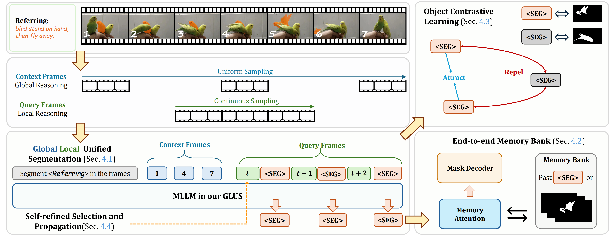

# GLUS: Global-Local Reasoning Unified into A Single Large Language Model for Video Segmentation
<div style="text-align: center;">
  <p>
    <a href="https://openreview.net/profile?id=~Lang_Lin3">Lang Lin</a>*, 
    <a href="https://openreview.net/profile?id=~Xueyang_Yu1">Xueyang Yu</a>*, 
    <a href="https://ziqipang.github.io/">Ziqi Pang</a>*, 
    <a href="https://yxw.web.illinois.edu/">Yu-Xiong Wang</a>
  </p>
</div>

[[`Project Page`](https://glus-video.github.io/)] [[`arXiv(Coming soon)`]()]


[](https://glus-video.github.io/) 


<div align=center>

</div>

## Installation
```shell
pip install -r requirements.txt
pip install flash-attn --no-build-isolation
```

## Model Families

## Training and Validation

### 1. Data Preparation

Please follow the below architecture to prepare the datasets. We recommend to set ``DATASET_ROOT``  to ``GLUS_ROOT/data``.

1. RefVOS Datasets: [MeViS](https://github.com/henghuiding/MeViS), [Refer-YouTube-VOS](https://codalab.lisn.upsaclay.fr/competitions/3282#participate-get-data), [Ref-DAVIS17](https://github.com/wjn922/ReferFormer/blob/main/docs/data.md).
2. Reasoning VOS Datasets: [ReVOS](https://github.com/cilinyan/ReVOS-api), [ReasonVOS](https://github.com/showlab/VideoLISA/blob/main/BENCHMARK.md)
3. Open-Vocabulary Video Instance Segmentation Dataset: [LV-VIS](https://github.com/haochenheheda/LVVIS/tree/main).

<details open>
<summary> <strong>Datasets Architecture</strong> </summary>

```
DATASET_ROOT
├── mevis
│   ├── train
│   │   ├── JPEGImages
│   │   ├── mask_dict.json
│   │   └── meta_expressions.json
│   ├── valid
│   │   ├── JPEGImages
│   │   └── meta_expressions.json
│   └── valid_u
│       ├── JPEGImages
│       ├── mask_dict.json
│       └── meta_expressions.json
├── Refer-YouTube-VOS
│   ├── meta_expressions
│   │   ├── train/meta_expressions.json
│   │   └── valid/meta_expressions.json
│   ├── train
│   │   ├── JPEGImages
│   │   └── Annotations
│   └── valid
│       └── JPEGImages
├── DAVIS17
│   ├── meta_expressions
│   │   ├── train/meta_expressions.json
│   │   └── valid/meta_expressions.json
│   ├── train
│   │   ├── JPEGImages
│   │   └── Annotations
│   └── valid
│       ├── JPEGImages
│       └── Annotations
├── LVVIS
│   ├── train
│   │   └── JPEGImages
│   ├── mask_dict.json
│   └── meta_expressions.json
├── ReVOS
│   ├── JPEGImages 
│   ├── mask_dict.json             
│   ├── mask_dict_foreground.json   
│   ├── meta_expressions_train_.json 
│   └── meta_expressions_valid_.json 
├── ReasonVOS
│   ├── JPEGImages 
│   ├── Annotations           
│   ├── meta_expressions.json 

```

</details>

### 2. Model Weights Preparation

Follow the guidance to prepare for the pretrained weights of LISA and SAM-2 for training GLUS:

1. Download the pretrained weights of LISA from [LISA-7B-v1](https://huggingface.co/xinlai/LISA-7B-v1/tree/main).
2. Download the pretrained weights of SAM-2 from [sam2_hiera_large](https://dl.fbaipublicfiles.com/segment_anything_2/072824/sam2_hiera_large.pt).
  
<details>
<summary> Then organize them in the following architecture: </summary>

```
WEIGHTS_ROOT
├── LISA-7B-v1
└── sam2_hiera_large.pt
```
   
We recommend to set ``WEIGHTS_ROOT`` to ``GLUS_ROOT/checkpoints``.

</details>

### 3. Training

Set the paths in the scripts and then run ``scripts/train_glus_s.sh`` or ``scripts/train_glus_a.sh``. The scripts will automatically start the training, and transform the saved checkpoint into hugging-face format when the training finished.

### 4. Evaluation

Set the paths, ``val_set`` and ``set_name`` in ``scripts/inference.sh``, and then run it. It will detect the available GPUs firstly and then individually run parallelizable inference on each gpu.

After the masks are generated completely, run the corresponding evalaution python file in ``utils``. You may need to set the groundtruth mask path, predicted mask path and expressions json file path. Please refer to the eval files to see the help on arguments.

Specially, to evaluate the performance on ``Refer-YouTube-VOS Valid`` or ``MeViS Valid`` benchmarks, you may need to submit the predicted masks results following the guidance at [MeViS-Evaluation-Server](https://codalab.lisn.upsaclay.fr/competitions/15094) or [RefYoutube-Evaluation-Server](https://codalab.lisn.upsaclay.fr/competitions/3282).

## Inference and Demo

Please refer to ``demo.ipynb`` to inference on your own videos and referrings.