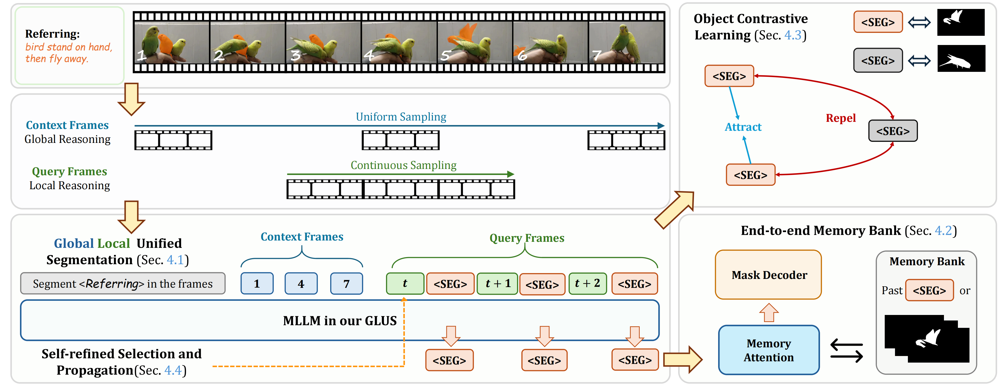

# GLUS: Global-Local Reasoning Unified into A Single Large Language Model for Video Segmentation

  

    <a href="https://openreview.net/profile?id=~Lang_Lin3">Lang Lin</a>*, 
    <a href="https://openreview.net/profile?id=~Xueyang_Yu1">Xueyang Yu</a>*, 
    <a href="https://ziqipang.github.io/">Ziqi Pang</a>*, 
    <a href="https://yxw.web.illinois.edu/">Yu-Xiong Wang</a>
  

[[`Project Page`](https://glus-video.github.io/)] [[`arXiv(Coming soon)`]()]

 

## Code Coming Soon!
